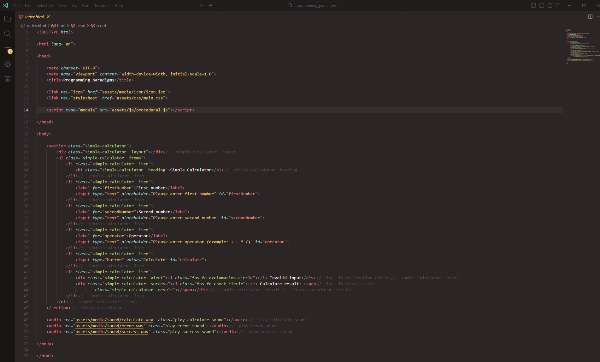

# **Programlashdirmada Paradigma**
## Programlashdirmada **paradigma** software development prossesinde istifade edilen ferqli dushunce ve yanashma modelleridir. Programlashdirma dilleri muxtelif paradigma-lar etrafinda formalashir ve her paradigma problemlerin helline ferqli bir baxish terzi getirir. En chox yayilan programlashdirma paradigma-lari ashagidakilardir:

1. **Obyekt Yonumlu Programlashdirma (OOP=> Object Oriented Programming)**
* Information: Obyekt yonumlu programlashdirmada **paradigma** obyektler esasinda teshkil olunar.
- Example languages: C++, Java, C#, Python
---
2. **Funksional Programlashdirma (FP=> Functional Programming)**
* Information: Funksional programlashdirma programlashdirmani riyazi funksiyalar uzerine qurar. Stateless ve pure funksiyalar istifade ederek programlashdirilar. Deyishmezlik (immutability) ve yan tesirinin olmamasi bu paradigma-nin temeli sayilir.
- Example languages: F#, Scala, Haskell
- Example image: 
- Example code: 
```javascript
function playAudio(element) {
    element.play();
}

function getValue(element) {

    let elementValue = element.value;
    return elementValue;
}

function addActiveClass({ element, className }) {
    element.classList.add(className);
}

function addMessage({ element, result }) {
    element.innerHTML = `${result}`;
}

function showSuccessInfo() {

    let activeSuccess = {
        element: simpleCalculatorSuccess,
        className: 'active'
    };

    playAudio(playSuccessSound);

    addActiveClass(activeSuccess);
}

function showErrorInfo() {

    let activeAlert = {
        element: simpleCalculatorAlert,
        className: 'active'
    };

    playAudio(playErrorSound);

    addActiveClass(activeAlert);
}

function hideInfo({ element, className, seconds }) {
    setTimeout(function () {
        element.classList.remove(className);
    }, seconds);
}

function validateInputs({ firstNumberValue, secondNumberValue, operatorValue }) {
    if (firstNumberValue.length !== 0 && secondNumberValue.length !== 0 && operatorValue.length !== 0) {
        let hideInfoObject = {
            element: simpleCalculatorSuccess,
            className: 'active',
            seconds: 1777
        };

        showSuccessInfo();

        hideInfo(hideInfoObject);
    }
    else {
        let hideInfoObject = {
            element: simpleCalculatorAlert,
            className: 'active',
            seconds: 1555
        };

        showErrorInfo();

        hideInfo(hideInfoObject);
    }
}

function Calculate({ firstNumberValue, secondNumberValue, operatorValue }) {
    switch (operatorValue) {
        case '+':
            return firstNumberValue + secondNumberValue;
        case '-':
            return firstNumberValue - secondNumberValue;
        case '*':
            return firstNumberValue * secondNumberValue;
        case '/':
            return firstNumberValue / secondNumberValue;
    }
}

calculateButton.addEventListener('click', function () {

    let inputsObject = {
        firstNumberValue: Number(getValue(firstNumberInput)),
        secondNumberValue: Number(getValue(secondNumberInput)),
        operatorValue: getValue(operatorInput)
    },
        messageObject = {
            element: simpleCalculatorResult,
            result: Calculate(inputsObject)
        };

    validateInputs(inputsObject);

    addMessage(messageObject);
});
```
---
3. **Prosedural Programlashdirma (Procedural Programming)**
* Information: Prosedural prgramlashdirma prosseslerin ve ya prosedurlarin bir sira icherisinde mueyyen edildiyi paradigma-dir. Bu modelde programlar prosseslere bolunur her prosses mueyyen bir vezifeni yerine yetirmish olur.
- Example languages: C, Pascal, Go, Fortran
- Example image: 
- Example code: 
```javascript
calculateButton.addEventListener('click', function (e) {
    e.preventDefault();

    // playCalculateSound.play();

    let firstNumberInputValue = Number(firstNumberInput.value),
        secondNumberInputValue = Number(secondNumberInput.value),
        operatorInputValue = operatorInput.value,
        result = '';

    switch (operatorInputValue) {
        case '+':
            result = firstNumberInputValue + secondNumberInputValue;
            break;
        case '-':
            result = firstNumberInputValue - secondNumberInputValue;
            break;
        case '*':
            result = firstNumberInputValue * secondNumberInputValue;
            break;
        case '/':
            result = firstNumberInputValue / secondNumberInputValue;
            break;
    }

    if (firstNumberInputValue.length !== 0 && secondNumberInputValue.length !== 0 && operatorInputValue.length !== 0) {
        playSuccessSound.play();
        simpleCalculatorSuccess.classList.add('active');
        simpleCalculatorResult.innerHTML = `${result}`;
        setTimeout(function () {
            simpleCalculatorSuccess.classList.remove('active');
        }, 1777);
    }
    else {
        playErrorSound.play();
        simpleCalculatorAlert.classList.add('active');
        setTimeout(function () {
            simpleCalculatorAlert.classList.remove('active');
        }, 1555);
    }
});
```
---
4. **Deklarativ Programlashdirma (Declarative Programming)**
* Information: Deklarativ programlashdirmada programchi
hell yolunun mentiqini mueyyenleshdirer amma programin nece ishleyeceyini programlashdirma dili ozu teyin edir.
- Example languages: HTML, CSS, SQL
- Example image: 
- Example code:
```html
<!DOCTYPE html>

<html lang="en">

<head>

    <meta charset="UTF-8">
    <meta name="viewport" content="width=device-width, initial-scale=1.0">
    <title>Programming paradigms</title>

    <link rel="icon" href="assets/media/icon/icon.ico">
    <link rel="stylesheet" href="assets/css/main.css">

    <script type="module" src="assets/js/procedural.js"></script>

</head>

<body>

    <section class="simple-calculator">
        <div class="simple-calculator__layout"></div>
        <ul class="simple-calculator__items">
            <li class="simple-calculator__item">
                <h1 class="simple-calculator__heading">Simple Calculator</h1>
            </li>
            <li class="simple-calculator__item">
                <label for="firstNumber">First number</label>
                <input type="text" placeholder="Please enter first number" id="firstNumber">
            </li>
            <li class="simple-calculator__item">
                <label for="secondNumber">Second number</label>
                <input type="text" placeholder="Please enter second number" id="secondNumber">
            </li>
            <li class="simple-calculator__item">
                <label for="operator">Operator</label>
                <input type="text" placeholder="Please enter operator (example: + - * /)" id="operator">
            </li>
            <li class="simple-calculator__item">
                <input type="button" value="Calculate" id="calculate">
            </li>
            <li class="simple-calculator__item">
                <div class="simple-calculator__alert"><i class="fas fa-exclamation-circle"></i> Invalid input</div>
                <div class="simple-calculator__success"><i class="fas fa-check-circle"></i> Calculate result: <span
                        class="simple-calculator__result"></span></div>
            </li>
        </ul>
    </section>

    <audio src="assets/media/sound/calculate.wav" class="play-calculate-sound"></audio>
    <audio src="assets/media/sound/error.wav" class="play-error-sound"></audio>
    <audio src="assets/media/sound/success.wav" class="play-success-sound"></audio>

</body>

</html>
```
5. **Multi-paradigm Programlashdirma**
* Information: Multi-paradigm birden chox programlashdirma paradigm-ni destekleyen diller ve ya yanashmalar uchun istifade edilir. Multi-paradigm bir dil ise ferqli paradigm-lerde olan usullari bir araya getirir ve istifadechilere bu paradim-lere uygun shekilde kod yazma azadligini temin edir.
- Example languages: Python, C++, JavaScript
6. **Imperative**
* Information: Bu paradigm programlashdirma dunyasinda cpu-ya step by step nece bir ish goreceyini izah eden bir yanashma terzini ifade edir. Bu paradgim programin command-larla idare edilmesine aiddir.
7. **Parallel Processing Paradigm**
* Information: Bu paradigm boyuk prossesleri daha kichik parchalara ayiraraq bu parchalarin bir-birinden asli olmadan ve eynizamanda ishlemesini temin edir. Bele olan halda prossesin zamani qisalir ve sistemin resurslari daha semereli istifade olunur. Daha chox elmi hesablamalar ve AI Machine Learning, graphic engine-larda istifade olunur. Bu paradigm-in esas hedefi suret ve qazanc artishidir. 
- Example languages: C/C++ (OpenMP, MPI), CUDA
8. **Logic Processing Paradigm**
* Information: Bu paradigm meseleleri mentiqi qanunlar ve realliqlarla mueyyen etmeye soykenir ve programin birbasha neticeye chatmasini temin eder. En esasi programchi prossesin nece edileceyin mueyyen etmez, bunun yerine sadece hansi shertlerin dogru oldugunu mueyen eder. Daha chox istifade olundugu saheler danishiq dilleri, AI ve data analizidir.
Example languages: Prolog, Datalog, Mercury