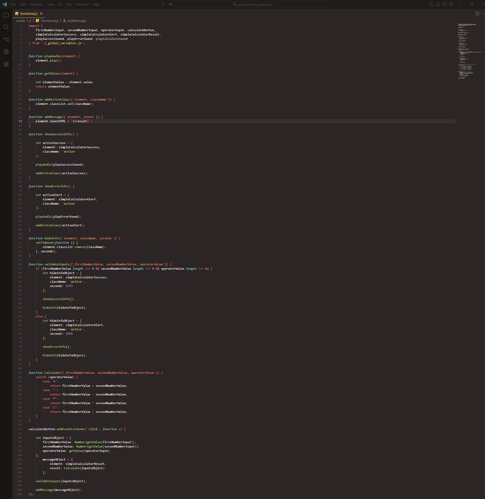
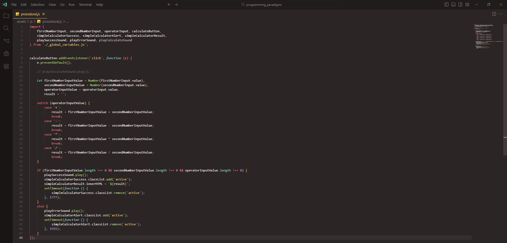

# Programlashdirmada ***Paradigm***
## Programlashdirmada **paradigm** software development prossesinde istifade edilen ferqli dushunce ve yanashma modelleridir. Programlashdirma dilleri muxtelif paradigma-lar etrafinda formalashir ve her paradigma problemlerin helline ferqli bir baxish terzi getirir. En chox yayilan programlashdirma paradigma-lari ashagidakilardir:

1. **Obyekt Yonumlu Programlashdirma (OOP=> Object Oriented Programming)**
* Temel xususiyyetleri: Obyekt yonumlu programlashdirmada **paradigma** obyektler esasinda teshkil olunar.
- Example languages: C++, Java, C#, Python
---
2. **Funksional Programlashdirma (FP=> Functional Programming)**
* Temel xususiyyetleri: Funksional programlashdirma programlashdirmani riyazi funksiyalar uzerine qurar. Stateless ve pure funksiyalar istifade ederek programlashdirilar. Deyishmezlik (immutability) ve yan tesirinin olmamasi bu paradigmanin temeli sayilir.
- Example languages: F#, Scala, Haskell
- Example image: 
- Example code: 
```javascript
function playAudio(element) {
    element.play();
}

function getValue(element) {

    let elementValue = element.value;
    return elementValue;
}

function addActiveClass({ element, className }) {
    element.classList.add(className);
}

function addMessage({ element, result }) {
    element.innerHTML = `${result}`;
}

function showSuccessInfo() {

    let activeSuccess = {
        element: simpleCalculatorSuccess,
        className: 'active'
    };

    playAudio(playSuccessSound);

    addActiveClass(activeSuccess);
}

function showErrorInfo() {

    let activeAlert = {
        element: simpleCalculatorAlert,
        className: 'active'
    };

    playAudio(playErrorSound);

    addActiveClass(activeAlert);
}

function hideInfo({ element, className, seconds }) {
    setTimeout(function () {
        element.classList.remove(className);
    }, seconds);
}

function validateInputs({ firstNumberValue, secondNumberValue, operatorValue }) {
    if (firstNumberValue.length !== 0 && secondNumberValue.length !== 0 && operatorValue.length !== 0) {
        let hideInfoObject = {
            element: simpleCalculatorSuccess,
            className: 'active',
            seconds: 1777
        };

        showSuccessInfo();

        hideInfo(hideInfoObject);
    }
    else {
        let hideInfoObject = {
            element: simpleCalculatorAlert,
            className: 'active',
            seconds: 1555
        };

        showErrorInfo();

        hideInfo(hideInfoObject);
    }
}

function Calculate({ firstNumberValue, secondNumberValue, operatorValue }) {
    switch (operatorValue) {
        case '+':
            return firstNumberValue + secondNumberValue;
        case '-':
            return firstNumberValue - secondNumberValue;
        case '*':
            return firstNumberValue * secondNumberValue;
        case '/':
            return firstNumberValue / secondNumberValue;
    }
}

calculateButton.addEventListener('click', function () {

    let inputsObject = {
        firstNumberValue: Number(getValue(firstNumberInput)),
        secondNumberValue: Number(getValue(secondNumberInput)),
        operatorValue: getValue(operatorInput)
    },
        messageObject = {
            element: simpleCalculatorResult,
            result: Calculate(inputsObject)
        };

    validateInputs(inputsObject);

    addMessage(messageObject);
});
```
---
3. **Prosedural Prgramlashdirma (Procedural Programming)**
* Temel xususiyyetleri: Prosedural prgramlashdirma prosseslerin ve ya prosedurlarin bir sira icherisinde mueyyen edildiyi paradigma-dir. Bu modelde programlar prosseslere bolunur her prosses mueyyen bir vezifeni yerine yetirmish olar.
- Example languages: C, Pascal, Go, Fortran
- Example image: 
- Example code: 
```javascript
calculateButton.addEventListener('click', function (e) {
    e.preventDefault();

    // playCalculateSound.play();

    let firstNumberInputValue = Number(firstNumberInput.value),
        secondNumberInputValue = Number(secondNumberInput.value),
        operatorInputValue = operatorInput.value,
        result = '';

    switch (operatorInputValue) {
        case '+':
            result = firstNumberInputValue + secondNumberInputValue;
            break;
        case '-':
            result = firstNumberInputValue - secondNumberInputValue;
            break;
        case '*':
            result = firstNumberInputValue * secondNumberInputValue;
            break;
        case '/':
            result = firstNumberInputValue / secondNumberInputValue;
            break;
    }

    if (firstNumberInputValue.length !== 0 && secondNumberInputValue.length !== 0 && operatorInputValue.length !== 0) {
        playSuccessSound.play();
        simpleCalculatorSuccess.classList.add('active');
        simpleCalculatorResult.innerHTML = `${result}`;
        setTimeout(function () {
            simpleCalculatorSuccess.classList.remove('active');
        }, 1777);
    }
    else {
        playErrorSound.play();
        simpleCalculatorAlert.classList.add('active');
        setTimeout(function () {
            simpleCalculatorAlert.classList.remove('active');
        }, 1555);
    }
});
```
---